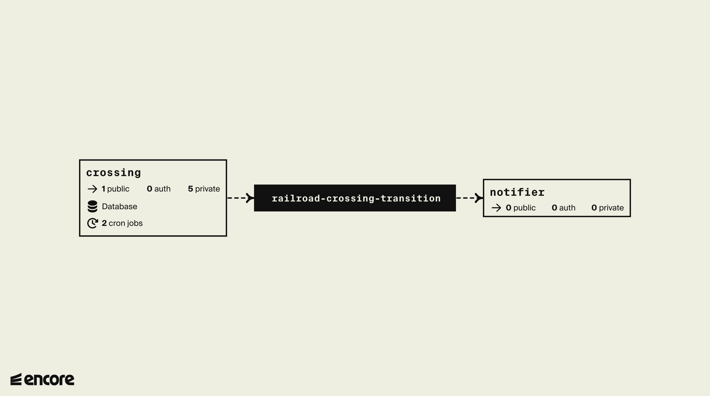

# htx-rr
Monitors the railway crossing status for Houston railroads.

This application continuously monitors the railrod crossing signs in Houston. When a 
change is detected in a crossing sign, a notification is sent to users subscribed 
to a crossing sign.

## Why
Stopped trains have plagued Houston's residents with some neighborhoods experiencing
as much as 50 trains daily and with an average stoppage time of 30 minutes. Sometimes lasting
hours.

For additional reading, [here](https://www.houstonpublicmedia.org/articles/infrastructure/2023/06/05/453633/houston-blocked-railroad-crossing-underpass-federal-grant/) or [here](https://www.fox26houston.com/news/its-getting-worse-east-end-residents-concerned-over-rail-blockings-speak-to-federal-administrators).

